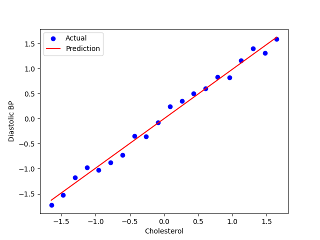

# gradient-descent-regression

A simple project that uses gradient descent to fit a linear regression model to predict diastolic blood pressure from cholesterol levels.

## Features
- Implemented gradient descent from scratch
- Predicts blood pressure using real patient data
- Includes convergence plots and model evaluation

## Project Structure
- `main.py`: Runs the full workflow
- `model/linear_regression.py`: Core gradient descent logic
- `utils/visualize.py`: Plotting functions
- `data/`: Contains sample dataset
- `result/`: Contains output visualizations

## Result

  

## Requirements
pip install -r requirements.txt

